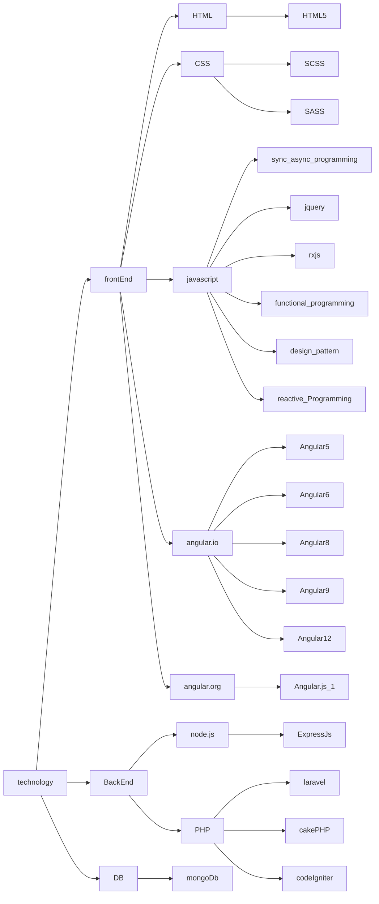

# Dhananjay Rajendra Belhekar

|Projects          |From Data - To Date |
|------------------|--------------------|
|Budget Sheet Automation|Nov-2021 To Feb-2022|
|Mahindra IMCR     |Aug-2021 To Jan-2022|
|Pricing Automation|Oct-2020 To Feb-2022|
|Mahindra eRFQ     |Feb-2019 T0 Dec-2020|
|Oneqlik           |Jun-2018 to Feb-2019|
|AFZET             |Jan-2018 To Jun-2018|
|Treasured Works   |Aug-2016-Jan-2018   |
|Tekreliance       |Jan-2016 To Aug-2016|
|mediplus          |Jun-2015 To Jan-2016|

> Technical Skills

